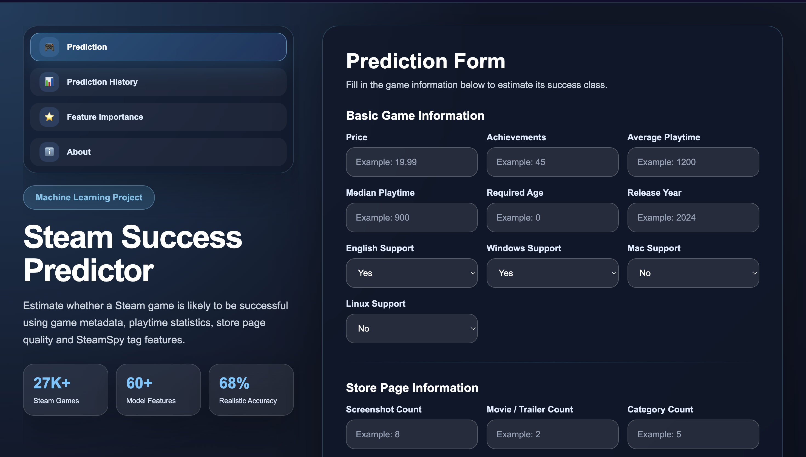
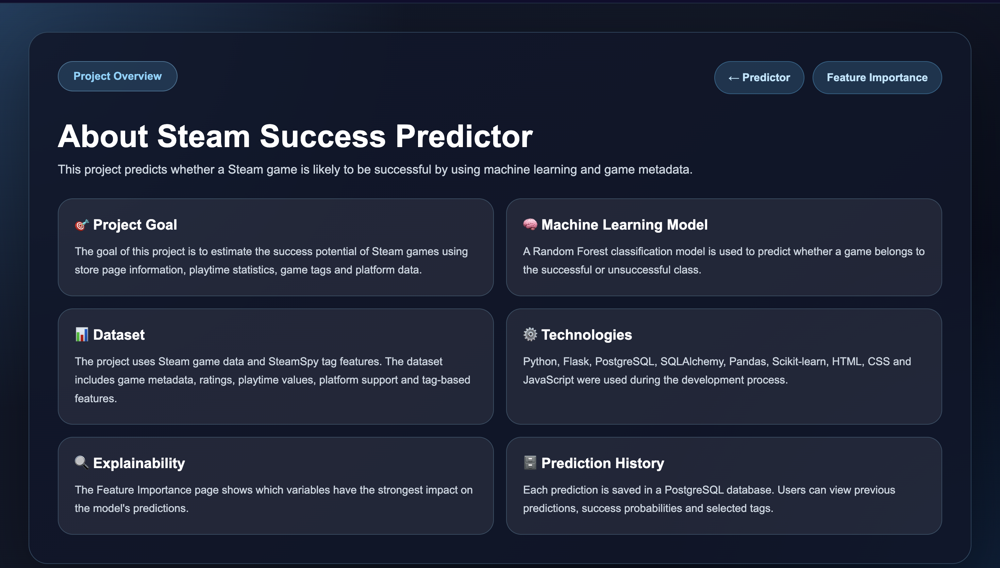

# 🎮 Steam Game Success Prediction


---

# 📌 Project Overview

Steam Game Success Prediction is a machine learning-based web application that predicts whether a Steam game is likely to be successful using game metadata, platform support, playtime statistics, and SteamSpy tag features.

The project combines exploratory data analysis, machine learning, database management, and web development into an interactive dashboard where users can enter game features, receive success predictions, analyze confidence scores, review prediction history, and explore feature importance.

The application was developed using Flask, PostgreSQL, Pandas, Scikit-learn, and a Random Forest classification model trained on more than **27,000 Steam games**.

---

# ✨ Features

- 🎯 Predict Steam game success using Machine Learning
- 📊 Display success probability and failure probability
- 📈 Confidence score and risk level analysis
- 💡 AI-generated recommendations
- 📝 Interactive prediction form
- 🏷️ SteamSpy tag support
- 📚 Store prediction history using PostgreSQL
- ⭐ Feature importance visualization
- ℹ️ About page
- 🎨 Modern and responsive user interface
- 🔒 Secure database configuration using environment variables

---

# 🛠 Technologies Used

## Backend

- Python
- Flask
- Flask-SQLAlchemy

## Database

- PostgreSQL

## Machine Learning

- Scikit-learn
- Pandas
- NumPy
- Joblib

## Frontend

- HTML5
- CSS3
- Jinja2

## Development Tools

- VS Code
- Git
- GitHub

---

# 📊 Machine Learning Model

The prediction engine is based on a **Random Forest Classifier** trained using a dataset containing more than **27,000 Steam games**.

## Input Features

The model evaluates various game characteristics, including:

- Price
- Achievement Count
- Average Playtime
- Median Playtime
- Required Age
- Release Year
- Windows, macOS and Linux Support
- English Language Support
- Screenshot Count
- Movie / Trailer Count
- Category Count
- Genre Count
- SteamSpy Tag Features

## Prediction Output

The application provides:

- Success Prediction
- Success Probability
- Failure Probability
- Confidence Score
- Risk Level
- AI-generated Recommendations

---

# 📁 Project Structure

```text
steam_project/
│
├── app.py
├── README.md
├── requirements.txt
├── .env.example
├── .gitignore
│
├── data/
│   ├── raw/
│   └── processed/
│
├── models/
│   ├── steam_success_model.pkl
│   └── model_features.pkl
│
├── reports/
│
├── src/
│   ├── data_analysis.py
│   ├── tag_analysis.py
│   └── model_training.py
│
├── static/
│   └── style.css
│
├── templates/
│   ├── index.html
│   ├── history.html
│   ├── feature_importance.html
│   └── about.html
│
└── images/
    ├── home_page.png
    ├── prediction_result.png
    ├── prediction_history.png
    ├── feature_importance.png
    └── about_page.png
```

---

# 🚀 Installation

Clone the repository:

```bash
git clone https://github.com/Tubaarpacay/steam_game_success_prediction.git
```

Navigate to the project directory:

```bash
cd steam_game_success_prediction
```

Install the required dependencies:

```bash
pip install -r requirements.txt
```

Create a `.env` file from `.env.example` and configure your PostgreSQL connection.

Run the application:

```bash
python app.py
```

Open your browser:

```text
http://127.0.0.1:5000
```

---

# 💻 Usage

1. Start the Flask application.
2. Open the project in your browser.
3. Fill in the game information.
4. Select the appropriate SteamSpy tags.
5. Click **Predict**.
6. Review the prediction results:
   - Success Prediction
   - Success Probability
   - Failure Probability
   - Confidence Score
   - Risk Level
   - AI-generated Recommendations
7. Explore additional pages:
   - Prediction History
   - Feature Importance
   - About

---

# 📸 Screenshots

## 🏠 Home Page



---

## 🎯 Prediction Result


---

## 📚 Prediction History


---

## ⭐ Feature Importance


---

## ℹ️ About Page



---

# 📈 Future Improvements

Possible future enhancements include:

- User authentication
- Docker support
- Cloud deployment
- Explainable AI (XAI)
- Additional Machine Learning algorithms
- REST API support
- Interactive data visualizations
- Automatic model retraining
- Game comparison module
- Dark / Light theme

---

# 👤 Developer

**Tuba Arpacay**

Software Engineering Student

**GitHub**

https://github.com/Tubaarpacay

**LinkedIn**

*(Add your LinkedIn profile here.)*

---

# 📄 License

This project was developed for educational, research, and portfolio purposes.

Commercial use is not intended without permission from the author.

---

⭐ If you found this project interesting, consider giving it a star on GitHub.